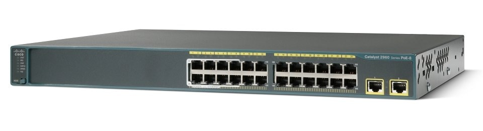
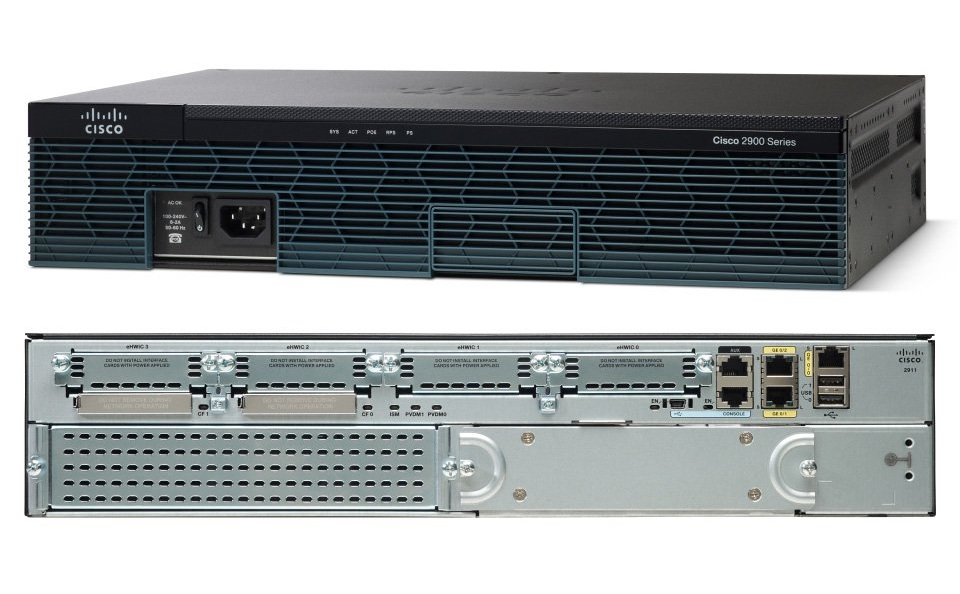
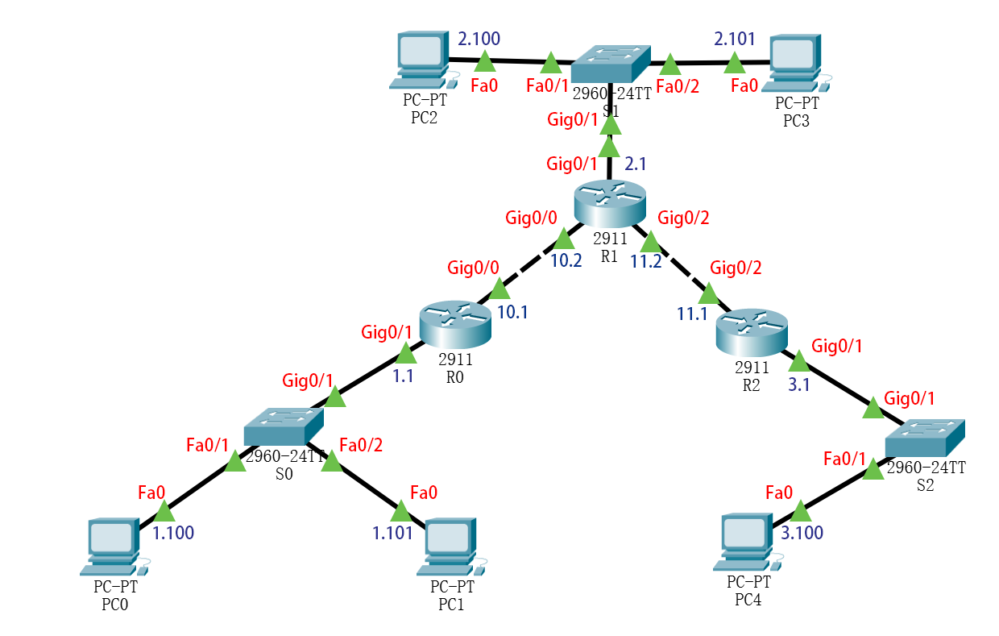
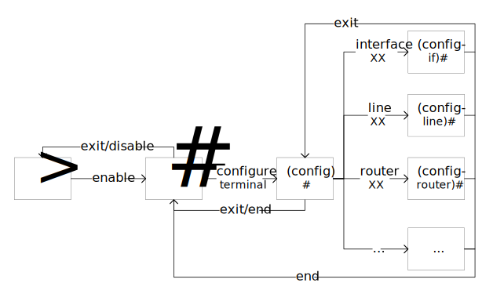

# 实验 1 - IP 组网

[TOC]

本次实验中，我们会学习 Linux 的命令行，同时掌握 Linux 中常见网络指令的使用；另外，我们还会通过配置虚拟的 Cisco 路由器来了解 IP 组网的具体过程。


## 实验原理

### Kernel，Shell 和 Terminal

每个**操作系统（OS）** 都有一个**内核（Kernel）**。内核是操作系统的一层，它将硬件与计算机上运行的主要程序连接起来。内核是操作系统的核心，是计算机启动时最先加载的。内核只提供编程接口，没有应用程序的辅助，用户是没办法直接用的。我们通常说的 Linux 操作系统，指的是基于 Linux 内核，再加上用户空间的应用程序之后的 Linux 发行版。

**Shell** 是实际处理命令和返回输出的程序。shell 会解释用户的输入，并调用对应的内核接口。大多数 shell 还管理前台和后台进程、命令历史和命令行编辑。这些功能（还有更多）是 bash 的标准功能，它是现代 Linux 系统中最常见的 shell。广义来说，KDE 和 GNOME 这些 Linux 下的图形用户界面也可以称做&ldquo;虚拟 shell&rdquo;或&ldquo;图形 shell&rdquo;。

**终端**（**Terminal**）是指一个运行 shell 的包装程序。几十年前，这是一个由显示器和键盘组成的物理设备。随着 Unix/Linux 系统增加了更好的多处理和窗口系统，这个终端的概念被抽象为软件。现在，你有一些程序，如 GNOME 终端，它在 GNOME 窗口环境中启动一个窗口，运行一个 shell，你可以在其中输入命令。

### 管道，重定向

Linux 中运行的每个程序都会自动打开三个文件：标准输入（stdin）、标准输出（stdout）和标准错误（stderr），分别对应文件描述符 0，1 和 2。通常情况下，在终端执行的命令以键盘作为标准输入读取，同时将标准输出和标准错误输出到屏幕。通过管道和重定向，我们可以改变这三个文件指向的对象。

Shell 中的管道符号`|`可以将前一条命令的标准输出作为后一条命令的标准输入；输入重定向符号`<`可以指定某个文件作为命令的标准输入；输出重定向符号`>`和`>>`则可以将标准输出写入文件，在目标文件已存在时，`>`会覆盖原文件，`>>`会在源文件之后追加内容。

### 地址，子网和路由

### Traceroute

`traceroute`（与 Windows 系统中的`tracert`功能相同）是一种电脑网络工具，它可以探测数据包在 IP 网络中经过的路由器。在 Linux 中，还有一个类似的工具`tracepath`，它功能较少，但不需要 root 权限即可工作。

`traceroute` 发送数据包的 TTL 值从 1 开始逐渐增加。路由器在路由时将数据包的TTL 值减 1，并丢弃TTL 值为 0 的数据包，返回 ICMP Time Exceeded 消息。`traceroute`使用返回的 ICMP Time Exceeded 消息来构建数据包经过的路由器列表，直到到达目的地。如果使用 UDP 数据包，目的地会返回 ICMP Destination Unreachable 消息；如果使用 ICMP Echo Request 消息，则返回 ICMP Echo Reply 消息。

如果数据包在预期的时间间隔内没有收到回复，则会显示一个星号。

### IP 组网

顾名思义，组网就是组织网络。对于个人电脑，连上网线或是连接 Wi-Fi 就可以说是成功组网了。但是对于交换机和路由器，就需要一些更复杂的配置。

| Cisco Catalyst 2960-24TT-L Switch                            | Cisco 2911 Integrated Services Router                        |
| ------------------------------------------------------------ | ------------------------------------------------------------ |
|  | |

上图两款设备分别是思科的交换机和路由器。这些交换设备里也是有运行一个操作系统，通常是设备商自己做的。用户配置设备时，就是通过终端的命令行界面输入指令。

由于不可能构建实际的网络环境用于学习组网的有关技能，本次实验使用 Packet Tracer 软件来帮助同学们理解 IP 组网。Packet Tracer 是思科设计的跨平台可视化仿真工具，它允许用户创建网络拓扑以模仿计算机网络和使用命令行界面来模拟配置思科路由器和交换机。Packet Tracer 的用户界面为拖放式，允许用户根据自己的需要添加或删除虚拟网络设备。该软件主要面向参加思科认证网络工程师（CCNA）认证考试的学生，作为他们备考的学习工具。


## 实验内容

### Linux 下常用网络指令

依次完成下面的实验，理解每一步的指令和输出内容。使用重定向将指令输出内容保存到文件中以供助教检查，要求回答输出内容的含义。虚拟机用户`ubuntu`的密码是`123456`。

1. 用`ip address`命令查看本机 IP 地址和以太网的硬件地址。
2. 1. 在虚拟机外 Windows 主机中打开命令提示符（cmd），输入`ipconfig`命令并在输出中找到适配器 VMnet8 的 IP 地址。
   2. 回到虚拟机，用`ip neigh`命令查看本机的 ARP 缓存表。如果里面有上一步查到的 IP 地址，使用`sudo ip neigh flush all`删除本机 ARP 缓存表的内容。
   3. 用`ping -c 4 <IP 地址>`命令向 VMnet8 发送报文（ICMP echo request）。
   4. 收到响应（ICMP echo reply）后，再次使用`ip neigh`命令查看本机 ARP 缓存表的内容，找到 VMnet8 对应的表项，并记录其 MAC 地址。
3. 用`ip route`命令查看本机的 IPv4 路由表，认真分析每条路由选项的含义。找到所在子网的子网掩码，并与前面`ip address`的结果做比较。
4. 用`sysctl net.ipv4.ip_forward`命令查看本机`net.ipv4.ip_forward`的配置值，实验结束后查找资料了解该配置的意义。
5. 用`sudo traceroute --icmp 202.38.64.1`观察从本机到`202.38.64.1`一共经过多少路由器。

### Cisco 路由器 IP 组网模拟

#### 拓扑搭建

拓扑需要 3 台 2911 路由器、3 台 2960 交换机和 5 台 PC。

| 设备     | Category        | Subcategory | Model                   |
| :------- | :-------------- | ----------- | ----------------------- |
| R0～R2   | Network Devices | Routers     | 2911                    |
| S0～S2   | Network Devices | Switches    | 2960 IOS15              |
| PC0～PC4 | End Devices     | End Devices | PC-PT                   |
| Cable    | Connections     | Connections | Copper Straight-Through |

搭建完应如下图所示，图中所有的 IP 地址前缀都是 192.168：



链路两端会显示不同颜色的三角形，它和真实思科设备的端口状态指示灯具有相同的含义：

- 熄灭（软件中为红色）：没有链接，或者该端口未被打开。
- 绿色：存在链接。
- 闪烁绿色：存在链接。此时端口是活动的，正在发送或接收数据。
- 琥珀色：端口被阻断以防止转发域中出现可能的环路（通常，端口在被激活后的前30秒将保持这种状态）。
- 闪烁琥珀色：端口被阻断以防止转发域中出现可能的环路。此时端口是活动的，正在发送或接收数据（由于被阻断，这里只能收发控制信息）。
- 绿色-琥珀色交替出现：链接故障。

#### 配置

配置后的网络应当满足各主机之间的互访问能力（各主机之间能够 ping 通），要求采用**静态路由**和 **RIP** 两种方法分别实现。

依次点击 PC，选择 Desktop 选项卡，打开 Command Prompt 进行配置。注意软件存在 Bug，输入完 ipconfig 之后需要点击一下 Config 选项卡，否则设置的网关会在关闭配置窗口后丢失。PC 配置参考：

```shell
# 格式：ipconfig 本机IP地址 掩码 网关IP地址
ipconfig 192.168.X.X 255.255.255.0 192.168.X.X
```

依次点击各交换机，选择 CLI 选项卡，输入命令进行配置。配完交换机后，可以使用 save 存档成 pkt 文件，复制一份备用。交换机配置参考：

```shell
enable # 进入特权模式
configure terminal # 进入全局配置模式

# 这一段是为了关闭多余的服务
no ip domain-lookup # 关闭自动域名查找
no spanning-tree vlan 1 # 关闭STP(生成树协议)
no cdp run # 关闭CDP(思科发现协议)

# 进入接口批量配置模式
interface range fastethernet 0/1-24

# 这一段是为了关闭多余的服务
switchport mode access # 设置端口类型为ACCESS
switchport nonegotiate # 关闭DTP(动态Trunking协议)

exit # 退出接口批量配置模式

# 进入接口批量配置模式
interface range gigabitethernet 0/1-2

switchport mode access
switchport nonegotiate

exit
end # 退出全局配置模式
write memory # 将当前配置写入NVRAM，保存配置防止reload后丢失
```

依次点击各路由器，选择 CLI 选项卡，输入命令进行配置。首次进入路由器配置界面会出现提示`Continue with configuration dialog?`，输入`no`。路由器配置参考：

```shell
enable
configure terminal

no ip domain-lookup
no cdp run

# 进入接口配置模式
interface gigabitethernet 0/X
ip address 192.168.X.X 255.255.255.0 # 设置接口IP地址和子网掩码
no shutdown # 启用接口，路由器接口默认关闭，交换机接口默认打开

exit

## 静态路由
# ip route 目的网络 掩码 网关
ip route 192.168.X.0 255.255.255.0 192.168.1X.X

## RIP动态路由
router rip
# 将与路由器直连的子网放入RIP信息库
network 192.168.X.0
network 192.168.1X.0

exit

end
write memory

show ip route # 显示路由表
```

最后给助教演示两种方法下的各个路由器最后生成的路由表，以及 PC0 ping PC4 和 从 PC0 ping PC3 的输出内容，完成验收。


**可能遇到的问题：**

- Q：我的配置都是正确的，为什么 ping 不通？<br>A：在极少数情况下，会触发 Packet Tracer 的 bug。将配置保存到文件，重新打开 Packet Tracer 并加载保存的配置就好了。
- Q：为什么配置好了开头两个 ping 包不通，后面的都正常？<br>A：因为刚开始 ARP 解析没有完成。
- Q：为什么静态路由配置完了之后有概率 ping 不通？<br>A：说明你配错了，反而启动了 ECMP，导致大概率 ping 通。注意检查路由表。


## 实验报告

实验报告要求完成以下思考题：

1. Linux 中`net.ipv4.ip_forward`配置是什么意思？在网关上该配置值应当是多少？
2. 结合 IP 组网实验，交换机接口和路由器接口有何不同？
3. 动态路由和静态路由在使用方式、适用场合方面有何区别？


## 附录

### Cisco 设备 CLI

Cisco 设备 CLI 的常见模式：

| 模式         | Mode                        | 提示符       |
| ------------ | --------------------------- | ------------ |
| 用户执行模式 | User EXEC Mode              | &gt;         |
| 特权执行模式 | Privileged EXEC Mode        | #            |
| 全局配置模式 | Global Configuration Mode   | (config)#    |
| 具体配置模式 | Specific Configuration Mode | (config-XX)# |



用户执行模式只允许有限数量的基本监视命令，不允许使用任何会改变路由器配置的命令。在用户执行模式下输入`enable`命令进入到&ldquo;特权执行模式&rdquo;，相比用户执行模式，它提供更多的命令和权限。在特权执行模式下输入`configure terminal`命令进入到&ldquo;全局配置模式&rdquo;。全局配置模式可以对系统进行（全局）配置，或者进入到相应的具体配置模式进行相应的具体细节配置。

在配置模式中，可以通过在指令前加`do`来临时运行执行模式中的指令。

使用`end`命令（或 Ctrl+Z）可以直接从（全局/具体）配置模式回到特权执行模式。

Cisco 设备 CLI 特点：

1. 命令不区分大小写
2. 在不引起混淆的情况下，支持命令简写
3. 可随时使用`?`来获取命令行帮助，使用 Tab 键进行命令补全
4. 要实现某条命令的相反功能，只需在该条命令前加`no`
5. 配置更改立即生效，重启不保留。若要重启保留，需使用`write memory`或`copy running-config startup-config`将当前配置写入 NVRAM。
