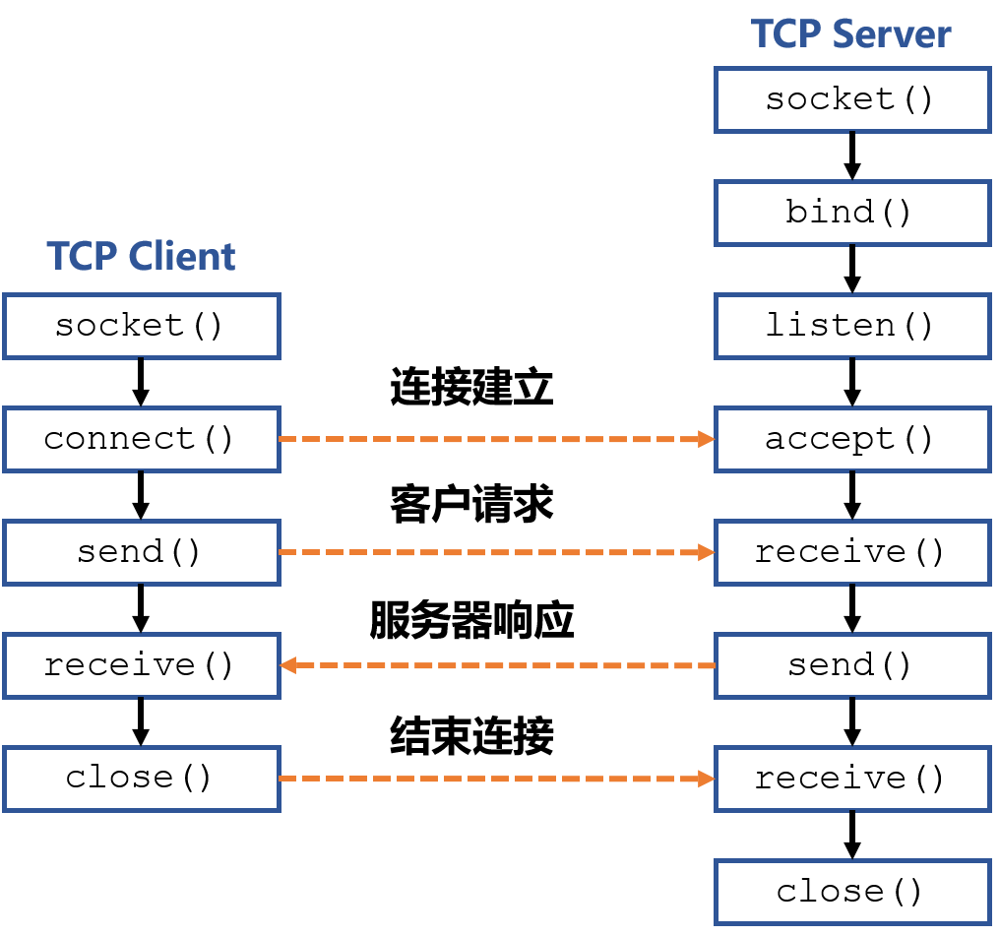
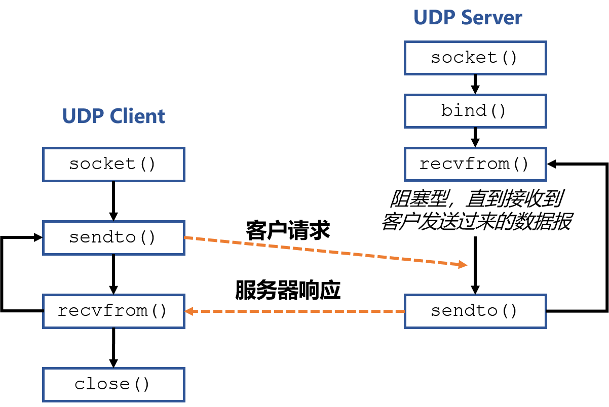
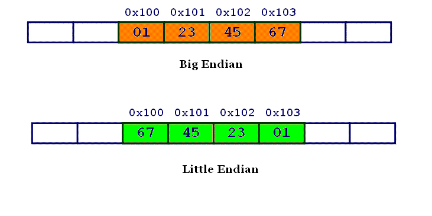

# 实验 2 - TCP/UDP 通信程序设计

[TOC]

在上一次实验中，我们学习了如何在网络层组网。这一次我们来到传输层，学习 socket 编程的基本概念和编程方法。本次实验中，我们会分别编写 TCP 和 UDP 的客户端/服务器通信程序，同时深入了解 TCP 和 UDP 的区别与联系。


## 实验原理

**套接字接口**（socket API）是一种处理进程间通信的编程接口。网络传输可以视作是不同主机上的应用程序进程之间的通信，因此套接字也可以作为传输层的编程接口。

**Berkeley 套接字**是一种套接字接口的实例，包括了一个用 C 语言写成的应用程序开发库，可以用于网络套接字与 Unix 域套接字。Berkeley 套接字接口已经成为了事实上的网络套接字的标准，大多数其他的编程语言使用与其类似的 API。


### 套接字函数

Berkeley 套接字提供以下函数：

#### socket

```c
int socket(int family, int type, int protocol);
```

函数 *socket()* 创建一个新的套接字并为它分配系统资源。*socket()* 需要三个参数：

- *family*：指定创建的套接字的协议族，常见的有：
  - `AF_INET`：用于网络协议 IPv4（仅限 IPv4）。
  - `AF_INET6`：用于 IPv6（在某些情况下，向下兼容 IPv4）。
  - `AF_UNIX`：用于本地套接字（使用特殊的文件系统节点）。
- *type*：指定套接字的类型，常见的有：
  - `SOCK_STREAM`：流套接字（Stream socket），面向连接的套接字，提供可靠的面向流的服务。
  - `SOCK_DGRAM`：数据报套接字（Datagram socket），无连接的套接字，不能保证顺序和可靠性。
  - `SOCK_RAW`：原始套接字（Raw socket），直接发送和接收 IP 数据包，无需任何特定于协议的传输层格式。
- *protocol*：协议指定实际传输协议来使用，常见的有：
  - `IPPROTO_IP`：值为 0，选择所选域和类型中的默认协议。
  - `IPPROTO_TCP`：TCP 协议，流套接字的默认协议。
  - `IPPROTO_UDP`：UDP 协议，数据报套接字的默认协议。

*socket()* 成功时返回一个指代新创建的套接字的文件描述符，如果发生错误则返回 -1。

#### bind

```c
int bind(int sockfd, const struct sockaddr *my_addr, socklen_t addrlen);
```

函数 *bind()* 将套接字与地址相关联，比如：IP 地址和端口号。当使用 *socket()* 创建套接字时，它只被赋予一个协议族，但没有分配地址。在套接字可以接受来自其他主机的连接之前，必须执行此关联。*bind()* 需要三个参数：

- *sockfd*：套接字描述符
- *my_addr*：指向表示要绑定到的地址的 *sockaddr* 结构的指针。
- *addrlen*：*socklen_t* 类型的字段，指定 *sockaddr* 结构的大小。

*bind()* 成功时返回 0，如果发生错误则返回 -1。

#### listen

```c
int listen(int sockfd, int backlog);
```

套接字与地址相关联后，*listen()* 为未来的连接做好准备，使绑定的套接字进入监听状态。但是，这仅对于面向连接的数据模式是必需的。*listen()* 需要两个参数：

- *sockfd*：套接字描述符。
- *backlog*：指定侦听队列的长度。侦听队列用于存放等待连接建立的套接字。一旦连接被接受，它就会出列。

*listen()* 成功时返回 0，如果发生错误则返回 -1。

#### accept

```c
int accept(int sockfd, struct sockaddr *client_addr, socklen_t *addrlen);
```

当应用程序正在侦听来自其他主机的连接时，它会收到此类事件的通知，并且必须使用函数 *accept()* 初始化连接。它为每个连接创建一个新的套接字并从侦听队列中删除该连接。*accept()* 需要三个参数：

- *sockfd*：正在侦听的套接字描述符。
- *client_addr*：指向接收客户端地址信息的 `struct sockaddr` 结构的指针。
- *addrlen*：指向 *socklen_t* 位置的指针，该位置指定传递给 *accept()* 的客户端地址结构的大小。当 *accept()* 返回时，此位置包含结构的大小（以字节为单位）。

*accept()* 成功时返回已接受连接的新套接字描述符，如果发生错误则返回值 -1。之后可以通过这个新的套接字与远程主机进行所有进一步的通信。数据报套接字不需要由 *accept()* 处理，因为接收者可以使用侦听套接字立即响应请求。

#### connect

```c
int connect(int sockfd, const struct sockaddr *server_addr, socklen_t addrlen);
```

函数 *connect()* 会通过一个套接字描述符，与一个由其地址确定的特定远程主机建立一个直接的关联。当使用面向连接的协议时，这就建立了一个连接。当与无连接协议一起使用时，*connect()* 会指定套接字发送和接收数据的远程地址，从而可以在该套接字上使用 *send()* 和 *recv()* 之类的函数。在这些情况下，*connect()* 函数同时会防止接收来自其他来源的数据报。

*connect()* 成功时返回 0，如果发生错误则返回 -1。从历史上看，在 BSD 衍生的系统中，如果调用 *connect()* 失败，套接字描述符的状态是未定义的，因此，在调用 *connect()* 失败的情况下，可移植的应用程序应该立即关闭套接字描述符。

#### send/recv、write/read、sendto/recvfrom

```c
ssize_t recv(int sockfd, void *buf, size_t nbytes, int flags);
ssize_t recvfrom(int sockfd, void *buf, size_t nbytes, int flags,
                 struct sockaddr *addr, socklen_t *addrlen);

ssize_t send(int sockfd, const void *buf, size_t nbytes, int flags);
ssize_t sendto(int sockfd, const void *buf, size_t nbytes, int flags,
            const struct sockaddr *addr, socklen_t addrlen);
```

- 对于已经通过 *connect()* 与远端地址关联的套接字，可以用 *send()* 和 *recv()* 来发送或接受数据。
- 对于没有关联的套接字，可以用 *sendto()* 和 *recvfrom()* 在发送或接受数据的时候指定远端地址。
- 由于 Unix 一切皆文件的哲学，套接字也被视作一种文件，可以用 *read()* 和 *write()* 来读写，用法类似于 *send()* 和 *recv()*。

#### close/shutdown

```c
int shutdown(int sockfd, int how);
```

*close()* 和 *shutdown()* 都被用来终止网络连接。

- *close()* 作为文件操作函数，实际上是将套接字描述符的引用计数减 1，仅在引用计数变为 0 时才关闭套接字。*close()* 一个 TCP 套接字的默认行为是将该套接字标记为已关闭，也就是说再也不能用它发送或接收数据。这一默认行为可以通过配置套接字选项来改变。
- 使用 *shutdown()* 可以无视引用计数就激发 TCP 的正常连接终止行为。另外，*shutdown()* 使用 *how* 参数来控制是关闭读、关闭写还是同时关闭读写。

#### setsocketopt/getsocketopt

```c
int setsockopt(int sockfd, int level, int optname, const void *optval, socklen_t optlen);
int getsockopt(int sockfd, int level, int optname, void *optval, socklen_t *optlen);
```

函数 *setsocketopt()* 和 *getsocketopt()* 用来获取和设置影响套接字的选项。鉴于可用的选项如此之多，这里只介绍这次实验会用到的选项。

在本次实验中，调试代码时经常会中途终止程序。当套接字已经绑定但没有正确终止时，操作系统会锁定套接字绑定的端口。在接下来的几分钟时间里，该端口无法再绑定。我们通过设置 `SO_REUSEADDR` 可以避免这种情况。


### 套接字地址

在上一节中，我们可以看到很多函数都使用了 `struct sockaddr` 这个结构体代表地址。结构如下：

```c
struct sockaddr {
    ushort  sa_family;
    char    sa_data[14];
};
```

由于 socket 支持多种协议，这里的 `struct sockaddr` 采用一种通用的格式，只定义了协议族 *sa_family* 和地址数据 *sa_data*。不同的协议可以使用各自的结构解释 *sa_data*，使用时再转换类型。例如 IPv4 使用的是 `struct sockaddr_in`，结构如下：

```c
struct sockaddr_in {
    short   sin_family;
    u_short sin_port;
    struct  in_addr sin_addr;
    char    sin_zero[8];
};
```

其中 *sin_port* 表示端口号，*sin_addr* 表示IP地址，*sin_zero* 是用来填充剩余空间的0。

一台计算机上可能同时有多个进程使用 TCP 和 UDP 等传输层协议，操作系统就是用端口号来区分这些进程。端口号是一个 16 位无符号整数，范围为 0 到 65535。对于 TCP，端口号 0 是保留的，不能使用，而对于 UDP，源端口是可选的，0 表示没有端口。IANA 维护着一个端口号分配状况的清单，其中端口号被分成三段：

1. well-known port，0～1023：由 IANA 分配和控制，分配给一些常见的服务，比如 80 端口用于 Web 服务器。
2. registered port，1024～49151：不受 IANA 控制，不过 IANA 会登记并提供这些端口的使用情况清单。
3. dynamic/private port，49152～65535：IANA 不管理这些端口，通常作为临时端口。


### 客户端/服务器模式

**客户端/服务器模式**是一种分布式应用程序结构，它在资源或服务的提供者（称为服务器，Server）和服务请求者（称为客户端，Client）之间划分任务或工作负荷。通常客户端和服务器在不同的硬件上通过网络进行通信。一个服务器主机运行一个或多个服务器程序，为一个或多个客户提供功能或服务，客户端可以对这些服务发起请求。电子邮件和万维网使用的通常都是客户端/服务器模式。

|                基本的TCP客户端-服务器通信流程                |                基本的UDP客户端-服务器通信流程                |
| :----------------------------------------------------------: | :----------------------------------------------------------: |
|  |  |


## 实验内容

附带的**代码参考**中有简单的 TCP 和 UDP 通信程序。理解这两份代码，在此基础上完成下面的实验。

1. 完成一个 TCP 回射程序
   - Client 从标准输入读入一行文本，发送给 Server。
   - Server 接收这行文本，再将其发送回 Client。
   - Client 接收到这行回射的文本，将其显示在标准输出上。
   - 使用`base64 /dev/urandom | head -n 30 > test`生成随机数据并保存到文件 test，将 Client 的标准输入重定向为 test 文件，标准输出重定向为 test_recv 文件。使用`md5sum`比较两个文件是否一致。注意判断输入是否结束，判断方法参考附录。
2. 完成一个 UDP 通信程序
   - Client 创建 10 个 socket，每个 socket 发送 1 个数据包给 Server，内容为任意字符串。
   - Server 在每次收到数据包时，将发送端的 IP 地址和端口号显示在标准输出上。
   - 要求 Client 使用 *connect()* 和 *send()* 实现，Server 使用 *recvfrom()* 实现。
3. **可选**，完成一个 TCP 通信程序
   - 利用 *fork()*，实现两终端实时通信。

最后给助教演示程序，完成验收。


**可能遇到的问题：**

- Q：我的程序和其他人一模一样为什么还是运行不了？<br>A：有很多种可能。
  - 缓冲区指针没有分配空间，是个野指针。野指针的行为是未定义的，可能在某些特殊情况下能运行成功。请仔细阅读参考代码。
  - 代码不是一模一样，存在低级的语法问题。用`ctrl+shift+i`格式化代码，再仔细观察。
- Q：UDP 为什么每次输出的端口号都一样？<br>A：因为你输出的是 Server 的端口号，不是 Client 的。
- Q：为什么 TCP 程序可以建立连接但是无法收发？<br>A：TCP Server 要使用 *accept()* 建立的子套接字收发，不要用监听的套接字收发。请仔细阅读实验原理和参考代码。


## 实验报告

实验报告要求完成以下思考题：

1. 解释 `struct sockaddr_in` 结构体各个部分的含义，并用具体的数据举例说明。
2. 说明面向连接的客户端和非连接的客户端在建立 socket 时有什么区别。
3. 说明面向连接的客户端和面向非连接的客户端在收发数据时有什么区别。
4. 比较面向连接的通信和无连接通信，它们各有什么优点和缺点？适合在哪种场合下使用？
5. 实验过程中使用 socket 的时候是工作在阻塞方式还是非阻塞方式，通过网络检索阐述这两种操作方式的不同。


## 附录

### 辅助函数介绍

#### inet_pton

```c
#include <arpa/inet.h>
int inet_pton(int af, const char *src, void *dst);
```

该函数将 IPv4 或 IPv6 地址从文本转换为二进制形式。

- *af*：地址族，必须是`AF_INET`或`AF_INET6`。
- *src*：*af* 为`AF_INET`时，指向一个包含 IPv4 网络地址的字符串，该地址为点分十进制。*af* 为`AF_INET6`时，指向一个包含 IPv6 网络地址的字符串。
- *dst*：*af* 为`AF_INET`时，指向一个`in_addr`结构体。*af* 为`AF_INET6`时，指向一个`in6_addr`结构体。

如果转换成功，返回 1。如果 *src* 不包含表示指定地址族中有效网络地址的字符串，返回 0 。如果 *af* 不包含有效的地址族，则返回 -1，并设置`errno`以指示错误。

```c
#include <arpa/inet.h>
const char *inet_ntop(int af, const void *src, char *dst, socklen_t size);
```

该函数将 IPv4 或 IPv6 地址从二进制形式转换为文本。参数含义参考 *inet_pton()*，注意 *dst* 必须是一个非空指针，*size* 指定 *dst* 的长度。*af* 为 `AF_INET`时，*size* 至少为 `INET_ADDRSTRLEN`。*af* 为 `AF_INET6`时，*size* 至少为 `INET6_ADDRSTRLEN`。

如果转换成功，返回一个指向 *dst* 的非空指针。如果出现错误，则返回 NULL，并设置`errno`以指示错误。

#### htons

计算机硬件有两种储存数据的方式：大端字节序（big endian）和小端字节序（little endian）：

- **大端字节序**：最高位字节存储在最低的内存地址处，后面字节依次存储。
- **小端字节序**：最低位字节存储在最低的内存地址处，后面字节依次存储。

`0x1234567`的大端字节序和小端字节序的写法如下图。



在网络应用中，字节序是一个必须被考虑的因素，因为不同机器类型可能采用不同标准的字节序，所以均按照网络标准转化。网络传输一般采用大端序，也被称之为**网络字节序**，或**网络序**。

Berkeley套接字定义了一组转换函数，用于 16bit 和 32bit 整数在网络序和**本机字节序**之间的转换：

```c
#include <arpa/inet.h>
uint32_t htonl(uint32_t hostlong);
uint16_t htons(uint16_t hostshort);
uint32_t ntohl(uint32_t netlong);
uint16_t ntohs(uint16_t netshort);
```

- *htonl()* 函数将无符号整数 *hostlong* 从主机字节以网络字节顺序。
- *htons()* 函数将无符号短整数 *hostshort* 从主机字节以网络字节顺序。
- *ntohl()* 函数将无符号整数 *netlong* 从网络字节顺序到主机字节顺序。
- *ntohs()* 函数将无符号短整数 *netshort* 从网络字节顺序到主机字节顺序。

#### perror

```c
#include <stdio.h>
void perror(const char *s);
```

*perror()* 函数会在标准错误输出上生成一条消息，描述在调用系统或库函数期间遇到的最后一个错误。 首先打印参数字符串 *s* （如果 *s* 不为`NULL`），然后错误消息和换行符。

错误号取自外部变量 `errno`，该值在发生错误时设置，但在成功调用 *perror()* 后不会清除。

### 如何使用 Windows 系统进行 Socket 编程实验

由于 Windows 不是一个完全实现 POSIX 标准的操作系统，因此不建议在 Windows 下进行实验。

如果一定要在 Windows 下进行实验，推荐使用 Unix 兼容层，比如 [Cygwin](https://www.cygwin.com)。Cygwin 实现了较为完整的 POSIX API，同时提供一套 GNU 开发工具集（如 GCC、GDB），因此可以编译为 UNIX 系统编写的代码。

此外，熟悉 Windows 网络编程的同学也可以自行使用 Winsock 来完成本次实验。

