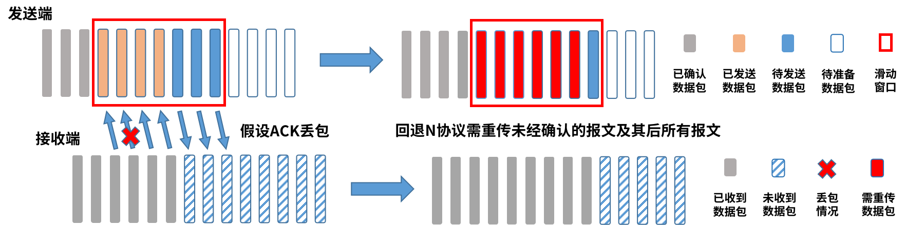
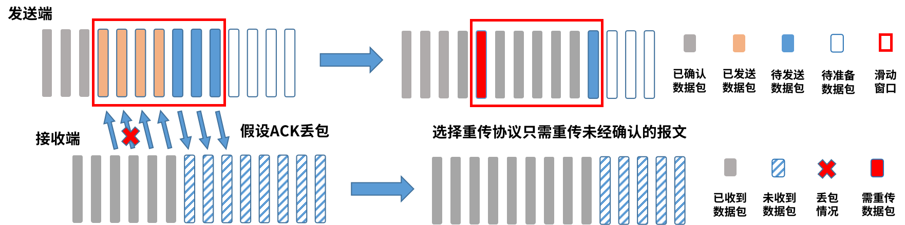

# 实验 3 - RDT 通信程序设计

[TOC]

在上一个实验中，我们学习了 socket 的使用，并且编写了 TCP、UDP 通信程序。为了加深对可靠数据重传中校验和、序列号、确认机制、超时重传及滑动窗口的理解，本次实验要求在 UDP 的基础上实现简化版的**可靠数据传输协议（Reliable data transfer protocols, RDT, RDP）**，并利用 RDT 传输一份文件。


## 实验原理

### 可靠通信

在实际应用的过程中，我们可以用很多种方法来实现可靠的通信。例如，最简单的办法是，发送端每次发送一个包，然后阻塞等待，直到收到来自接收端的`ACK`或者超时重发。这种方式被我们称为**停等协议**。但是，我们发现这种阻塞等待的办法效率太低了。发送端每次可以发送很多个包，然后等待接收端回送`ACK`。那么，接收端会按照顺序收到每一个包吗？需要给每一个包都返回`ACK`吗？这样会不会占用太多的网络带宽资源呢？基于通信效率和质量的思考，我们设计了**回退 N 协议**和**选择重传协议**。在这两个协议中，发送端可以一次性发送一组数据包，等待接收端进行操作。在回退 N 协议中，接收端可以进行累计确认（即回复收到完整包的最大序列号），同时，在发送端如果出现超时或者收到`NACK`，那么发送端必须重传该包以及其后的所有的包，这是因为发送端无法获知这之后的包是否正确收到了（因为接收端进行累计确认）。但是，我们认为这种方法效率较低，因为如果丢失了中间一个包而后续所有包都正确到达了，那么发送端将浪费大量资源进行重传。另一方面，在选择重传协议中，接收端挑选未收到的包回复`NACK`，发送端只发送超时的包或者收到`NACK`的包，大大降低了重传的开销。

具体来说，三种不同协议如下描述如下所示：

#### 停等协议（Stop Wait）

在此协议中，发送端每次只发送一个数据包，为此数据包设置超时定时器， 然后进入阻塞等待该数据包的确认消息。发送端如果收到接收端的`ACK`消息，则开始发送下一个数据包；如果超时或收到`NACK`消息，则重新发送数据包。接收端收到一个数据包后，检查该数据包序列号和当前预期的数据包的序列号`expectedseqnum`；如果收到完整的数据包，并且包序号等于 `expectedseqnum`，发送确认`ACK`消息；否则发送`NACK`消息。


#### 回退 N 协议（Go Back N）

在 GBN 协议中，发送端发送`[base, base+N-1]`的滑动窗口，为每个正在发送的数据包设置一个定时器。如果数据包`k`超时，所有`k`及以后的数据包重新发送。接收端只需要记住当前预期的数据包的序列号 `expectedseqnum`；如果收到完整的数据包，并且包序号等于 `expectedseqnum`，发送确认消息；否者将数据包丢弃，发送`NACK`。并使用累积确认方式发送`ACK`数据包。  

抽象地来看，GBN 发送端的状态可用上图来表示。在图 1 中，由于接收端成功收到了四个包，那么只需要回复`ACK,4`进行累计确认即可。在图 2 中吗，由于第三个包丢失了，接收端只能回复`ACK,2`给发送端，即使已经收到了序列号为 4 的包。发送端将会重传序列号为 3，4 的两个包。




#### 选择重传协议（Selective Retransmit）

GBN 协议效率较低，因为，如果发送方发现一个数据包出错，则其以后的数据包都需要重传，无论此数据包是否已被正确接收过。而选择重传协议则让发送方只重传出错的数据包。在该协议中，接收端维护一个缓存窗口`[base, base+N-1]`，如果接收的数据包的序列号在此窗口内，则将其缓存；如果接收到的数据包的序列号等于窗口最左边的值`base`，则将该数据包及其后连续的若干个已经收到确认的数据包交送到上层，此时窗口右移。对于发送端来说，需要给每个包维护一个计时器，如果该包超时，则重发该包。




### RDT 数据包格式

我们所定义的可靠 RDT 协议的头部字段组成方式如下：

```
|----------------|-------------------|--------------|----------------------|
|   UDP Header   |  RDT_Packet_type  | RDT_Seq_num  |   Application Data   |
|----------------|-------------------|--------------|----------------------|
```

首先，我们所定义的 RDT 包底层通信依赖于 UDP 协议。在 UDP 协议上层，我们定义的 RDT 数据头部只包含控制域（RDT_Packet_type）和序列号域（RDT_Seq_num）。最后是数据包的应用层内容。

- 控制域：用来标识 RDT 的包类型，可能的值如下：

  ```c
  #define RDT_CTRL_BEGN 0 // 初始包
  #define RDT_CTRL_DATA 1 // 数据包
  #define RDT_CTRL_ACK 2  // ACK包
  #define RDT_CTRL_END 3  // 结束包
  ```

- 序列号域：用来标识此 RDT 包的序列号，在实验中从 1 开始并且永不循环。

  ```c
  #define RDT_BEGIN_SEQ 1 // RDT数据包初始序列号，假设数据包序列号不循环
  ```

实际使用中，RDT_Packet_type 和 RDT_Seq_num 都是 int 变量。因此，一个 RDT 数据包的头部字段长度为`RDT_HEADER_LEN = (4 + 4)` 。


## 实验内容

本次实验要求同学们使用 RDT 协议实现文件的可靠传输。附带的**代码参考**中有示例代码，TODO 注释标记的部分是需要同学自行编写的，请理解代码，并根据注释的提示完成。

1. 编写停等协议的 RDT 接收端程序。随代码一起有一份停等协议发送端可执行文件，可以用来帮助调试。
2. 编写停等协议的 RDT 发送端程序。用上面编写的接收端程序调试。
3. **可选**，编写 Go-back-N 协议的 RDT 发送端程序，并理解信号量的作用。Go-back-N 协议的接收端和停等协议的接收端相同，用上面编写的接收端程序调试。

最后给助教演示程序，完成验收。


## 实验报告

1. RDT 底层是 UDP，为什么程序中可以用`recv`/`send`，而不是`recvfrom`/`sendto`收发数据？
2. 停等发送端程序中是如何实现超时重传的？
3. 在有发送和接收失败的情况下，怎么保证双方正确地结束通信（参考两军对垒问题）？
4. 在选择重传协议中为何窗口大小必须小于或等于序列号空间大小的一半？


## 附录

### poll

这一次实验我们会用到更高级的 socket 函数—— *poll()* 。在 Linux，它已被 *ppoll()* 和 *epoll()* 取代。为了简单起见，我们这里仍然使用 *poll()* 完成实验。

```c
#include <poll.h>
int poll(struct pollfd *fds, nfds_t nfds, int timeout);
```

poll 这个单词的意思是轮询，函数 *poll()* 可以用来等到一组文件描述符中的一个准备好执行 I/O 操作。*poll()* 需要三个参数：

- *fds*： 要监视的文件描述符集，结构如下：

  ```c
  struct pollfd {
      int   fd;         // 文件描述符
      short events;     // 关注的事件：该描述符是可读、可写or异常？
      short revents;    // 返回的事件：真正发生了什么
  };
  ```

  其中，*events* 的值需要自己设置，定义的是我们所关注的事件。例如，`pollfd.events = POLLIN | POLLOUT` 表示我们关注“有数据可读”或者 “有数据可写”。

- *nfds*：*nfds_t* 类型的字段，指定 *fds* 数组的长度。

- *timeout*：指定 *poll()* 函数等待的最长时间，单位为毫秒。-1 表示永远阻塞等待。0 表示立即返回，不阻塞。

如果成功执行，*poll()* 返回一个非负值，即 *fds* 中 *revents* 字段被设置为非零值的元素的数量（表示有事件或错误）。 返回值为 0 表示在超时时间内没有事件发生。如果发生错误，返回 -1，并设置 `errno` 来表示错误。

本次实验，我们可以在停等协议的发送端使用 *poll()* 来检查套接字是否有可读的`ACK`数据。
